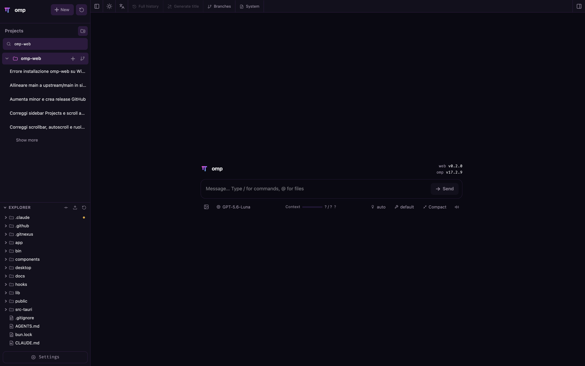
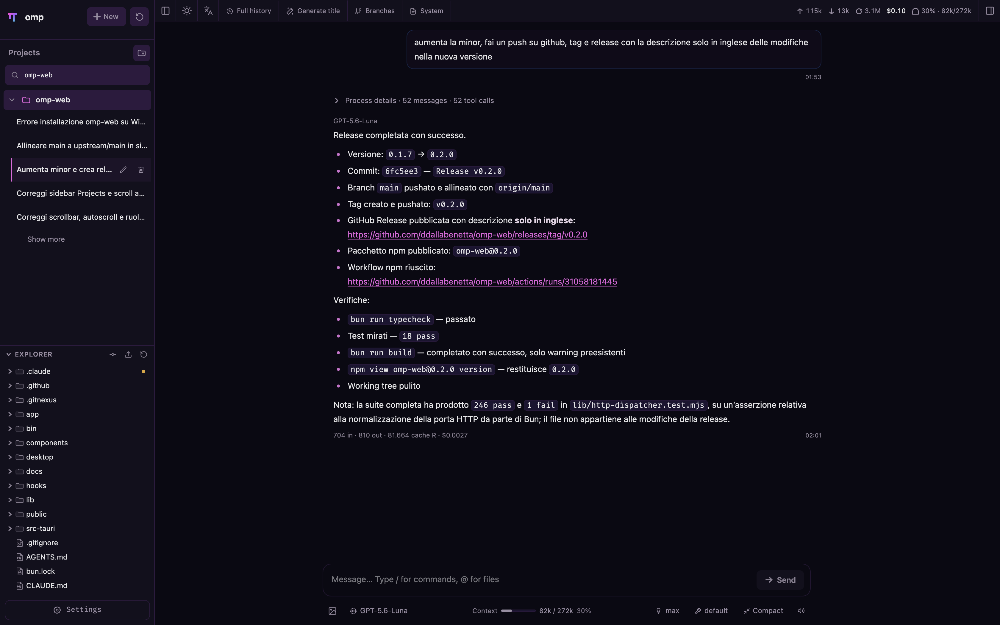
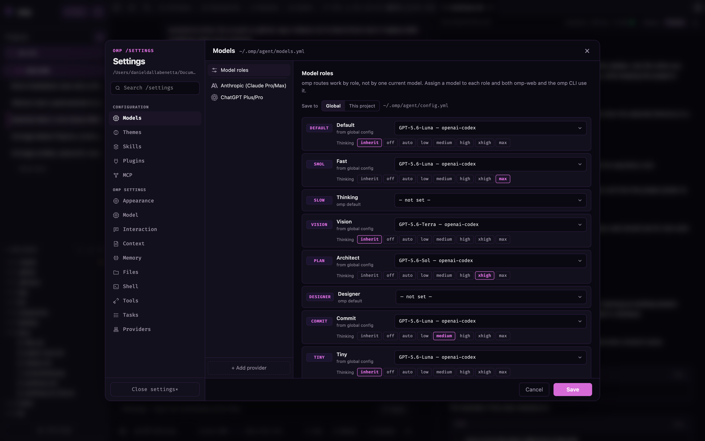

<p align="center">
  
</p>

<h1 align="center">Reeve</h1>

<p align="center">
  A desktop workspace for the <a href="https://github.com/can1357/oh-my-pi">OMP</a> coding agent.<br>
  Free and open source. Updates itself. Shares <code>~/.omp/agent</code> with the <code>omp</code> command.
</p>

<p align="center">
  <a href="https://github.com/AndrewBeniston/omp-reeve/releases/latest"></a>
  <a href="https://github.com/AndrewBeniston/omp-reeve/actions/workflows/ci.yml"></a>
  <a href="./LICENSE"></a>
  <a href="https://ko-fi.com/andrewbeniston"></a>
</p>

## Download

| macOS | Windows | Linux |
| --- | --- | --- |
| [Download for macOS](https://github.com/AndrewBeniston/omp-reeve/releases/latest) | Coming in the next release | Coming in the next release |
| `.dmg` for Apple Silicon or Intel, signed and notarized | `.exe` installer, x64 | `.AppImage`, x64 |

Reeve checks for a new version on launch and every four hours, downloads it in the background, and installs it when you press **Restart now**.

**macOS note.** Download the Apple Silicon package on an M-series Mac and the Intel package on an older Mac. Reeve updates itself with the matching package.

**Windows note.** 0.5.0 has no Windows package. It follows in the next release, unsigned at first, so SmartScreen will show "Windows protected your PC" on first run. Choose **More info**, then **Run anyway**.

**Linux note.** 0.5.0 has no Linux package. The AppImage follows in the next release. Make it executable, then run it: `chmod +x Reeve-*.AppImage && ./Reeve-*.AppImage`.

## What Reeve does

- **Pick work back up.** Browse previous OMP conversations by project without digging through terminal history.
- **Route by role.** Assign and switch models per scope of work, the same roles OMP uses for subagents, plan mode, and commits.
- **Try different directions safely.** Continue from an earlier message or fork a session into a separate route.
- **Work across branches.** Switch Git worktrees from the sidebar so new sessions and the Explorer follow the checkout you choose.
- **Chat beside the project.** Browse files on the left and preview source, docs, images, audio, and PDFs on the right while the agent works.
- **See session state clearly.** The Context donut shows usage and cost. Summary shows branches and the system prompt.
- **Configure less from the terminal.** Manage providers, logins, API keys, model tests, plugins, and skills from the interface.

Reeve needs the [OMP](https://github.com/can1357/oh-my-pi) coding agent installed. Reeve is the interface. OMP is the engine.

## Support

Reeve is free and will stay free. If it earns its place on your desktop, a star helps other people find it, and a [coffee on Ko-fi](https://ko-fi.com/andrewbeniston) keeps the macOS signing certificate paid and the releases coming.

## Screenshots

**Session browsing and file explorer.** Projects and past sessions on the left, the project's real file tree underneath.



**Chat view.** An agent run with tool calls, cost, and context usage.



**File preview.** The chat pane next to a rendered Markdown file.


**Settings.** Model role assignments.



## Run from source

Reeve serves its API on Bun because the OMP SDK imports Bun-specific modules. Install Bun 1.3.14 or newer.

```bash
curl -fsSL https://bun.sh/install | bash        # macOS / Linux
powershell -c "irm bun.sh/install.ps1 | iex"    # Windows
bun install
bun run dev                                     # http://127.0.0.1:30141
```

`bun run desktop:dev` opens the Electron shell against that server. `bun run desktop:build` packages it.
`RELEASING.md` holds the release procedure. `CONTRIBUTING.md` holds the contributor rules. `AGENTS.md` holds the developer notes and the file map.

## Browser and server use

Reeve also runs as a web application on a machine you control. Every API endpoint can sit behind a local password.

```bash
reeve --port 8080
reeve --hostname 0.0.0.0
reeve --authenticated
reeve --reset-password
OMP_WEB_PASSWORD='a-long-random-password' reeve
```

See [docs/authentication.md](./docs/authentication.md), [docs/docker.md](./docs/docker.md), [docs/model-roles.md](./docs/model-roles.md), [docs/http-proxy.md](./docs/http-proxy.md), and [docs/worktrees.md](./docs/worktrees.md).

## Licence

MIT. Reeve began as a fork of [omp-web](https://github.com/ddallabenetta/omp-web) by ddallabenetta, and that notice stays in [LICENSE](./LICENSE). Autospawn Sans ships under the SIL Open Font Licence 1.1, see [public/fonts/OFL.txt](./public/fonts/OFL.txt).
