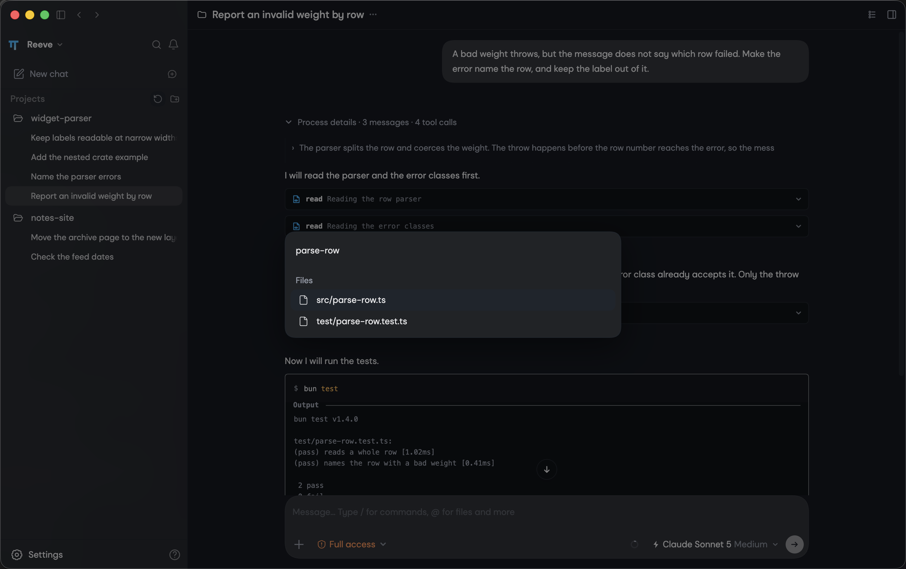
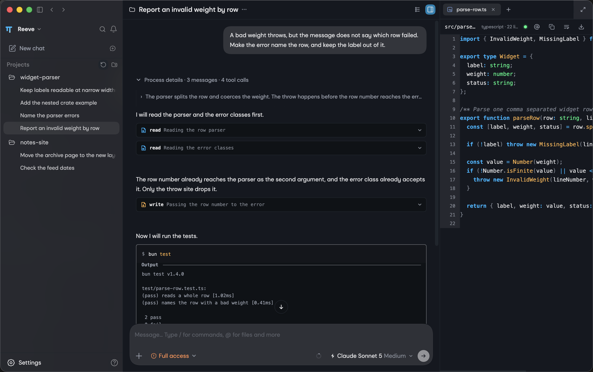
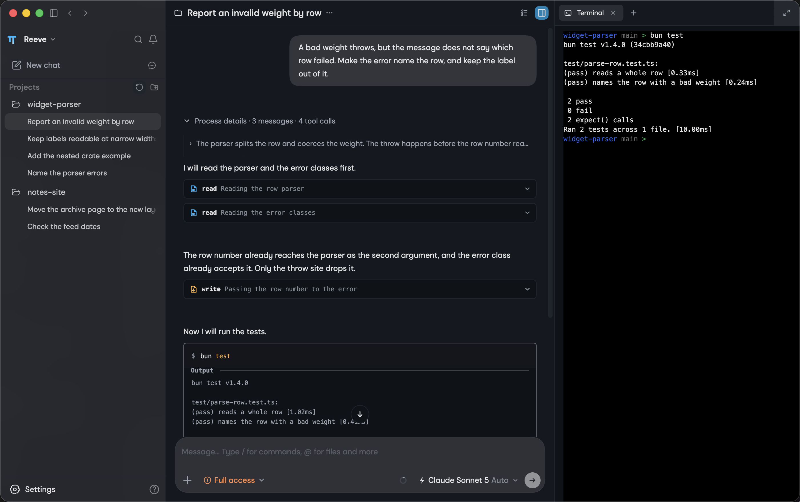

<p align="center">
  
</p>

<h1 align="center">Reeve</h1>

<p align="center">
  A desktop workspace for the <a href="https://github.com/can1357/oh-my-pi">OMP</a> coding agent.<br>
  Free and open source. Updates itself. Shares <code>~/.omp/agent</code> with the <code>omp</code> command.
</p>

<p align="center">
  <a href="https://github.com/AndrewBeniston/omp-reeve/releases/latest"></a>
  <a href="./LICENSE"></a>
  <a href="https://ko-fi.com/andrewbeniston"></a>
</p>

## Why

I use the OMP coding agent every day, and I like it. I wanted a desktop application to sit on top of it. So I am building one.

Reeve is the interface. OMP is the engine. Reeve reads the same sessions, models and skills, so you can start work in the terminal and carry on in the window.

One person builds this in his own time. Progress is steady rather than fast.

## Download

| macOS | Windows | Linux |
| --- | --- | --- |
| [Download for macOS](https://github.com/AndrewBeniston/omp-reeve/releases/latest) | [Download for Windows](https://github.com/AndrewBeniston/omp-reeve/releases/latest) | Coming in a later release |
| `.dmg` for Apple Silicon or Intel, signed and notarized | `.exe` installer, x64 | `.AppImage`, x64 |

Install the [OMP](https://github.com/can1357/oh-my-pi) coding agent first. Reeve needs it.

Reeve checks for a new version on launch, downloads it in the background, and installs it when you press **Restart now**. Take the Apple Silicon package on an M-series Mac and the Intel package on an older Mac.

**Windows note.** The Windows installer is not signed yet. SmartScreen shows "Windows protected your PC" on the first run. Choose **More info**, then **Run anyway**.

## What it looks like

**Your projects and their sessions.** Pick up old work without reading terminal history.



**A file beside the chat.** Read source, docs, images, audio and PDFs while the agent works.



**A shell beside the chat.** The terminal runs in the project's own directory.



**Settings.** Models, skills, plugins and agent behaviour, without the terminal.


## Road map

Shipped:

- [x] Sessions, forks and branches, across your Git worktrees
- [x] A side panel that holds Review, Files, a terminal, a browser and a second chat
- [x] Read a pull request, comment on it and submit the review, without leaving the window
- [x] Providers, models, skills and plugins, all set from the interface
- [x] macOS and Windows packages

Next:

- [ ] Hand the application to the agent. It opens a tab, reads a page and puts the file it means in front of you.
- [ ] Sub-agents on screen. Each one gets its own row, its own transcript and its own tab.
- [ ] Charts and small interactive tools, drawn by the agent inside the chat.
- [ ] Richer session rows for goals, approvals, commits and pull requests.
- [ ] A Linux package.

## Support

Reeve is free and stays free. A star helps other people find it. A [coffee on Ko-fi](https://ko-fi.com/andrewbeniston) pays the macOS signing certificate and keeps the releases coming.

## Run from source

Reeve serves its API on Bun, because the OMP SDK imports Bun-specific modules. Install Bun 1.3.14 or newer.

```bash
curl -fsSL https://bun.sh/install | bash        # macOS / Linux
powershell -c "irm bun.sh/install.ps1 | iex"    # Windows
bun install
bun run dev                                     # http://127.0.0.1:30141
```

`bun run desktop:dev` opens the Electron shell against that server. `bun run desktop:build` packages it.
`CONTRIBUTING.md` holds the contributor rules. `AGENTS.md` holds the developer notes and the file map.

## Run in a browser

Reeve also runs as a web application on a machine you control. Every API endpoint can sit behind a local password.

```bash
reeve --port 8080
reeve --hostname 0.0.0.0
reeve --authenticated
```

See [docs/authentication.md](./docs/authentication.md), [docs/docker.md](./docs/docker.md), [docs/model-roles.md](./docs/model-roles.md), [docs/http-proxy.md](./docs/http-proxy.md) and [docs/worktrees.md](./docs/worktrees.md).

## Licence

MIT. Reeve began as a fork of [omp-web](https://github.com/ddallabenetta/omp-web) by ddallabenetta, and that notice stays in [LICENSE](./LICENSE). Autospawn Sans ships under the SIL Open Font Licence 1.1, see [public/fonts/OFL.txt](./public/fonts/OFL.txt).
